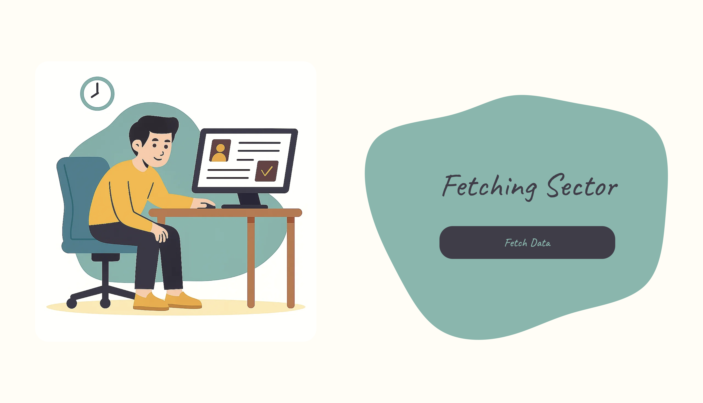
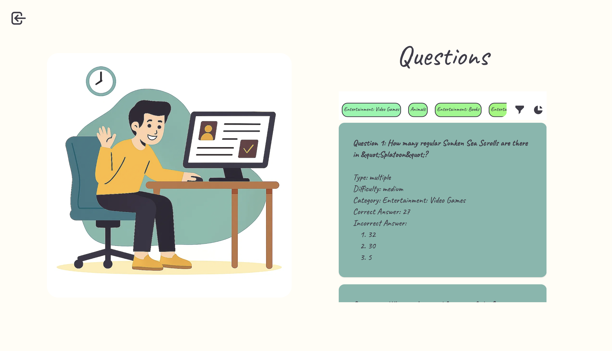

# Intelij Internship App

## 💡 Overview

Intelij Internship App was made in Vite + React + TypeScript. For styling im using tailwind and for animations framer-motion. State managment problem was solved by using redux.

## 🗒️ Pages

### Home Screen


### Questions Screen


### Charts Screen


### Loading Screen


### Error Screen


## 🗒️ Features
* Redux based state managment system;
* Clarity in design;
* Animations created in framer-motion;

## ⚙️ Command Tools

To work with this project locally or in a containerized environment, use the following commands:
```bash
npm run build # builds the project

npm run dev # run the project in developer mode
````

## 🧠 Tech Stack
<p align="center">
  <a href="https://skillicons.dev">
    
  </a>
</p>
 
